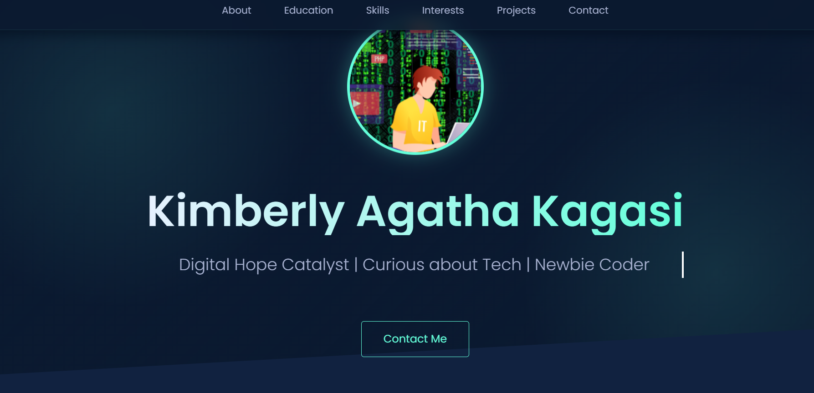

# Kimberly Agatha Kagasi - Portfolio Project

## Overview
This repository contains a professional portfolio website for Kimberly Agatha Kagasi, a Business Information Technology student passionate about tech and coding. The site showcases my skills, education, projects, and interests in an elegant, modern design with interactive elements.
This repository is not only for the PLP Hackathon July 2025 but also a chance for me to push my limits and test my capabilities when it comes to raw or vanilla HTML and CSS. I can positivelt say it has been an eye opening experience for me and I look forward to adding even more features to the portfolio using more of what I'll learn in the PLP Africa classes. 
With that said , here are the details entailed in my web portfolio website . Happy reading;



## Features
- **Modern Glassmorphism Design**: Sleek glass-like card components with subtle animations
- **Interactive Elements**: 
  - Typing effect hero section
  - Animated skill bars
  - Hover effects on cards and buttons
- **Responsive Layout**: Works on all device sizes
- **Section Organization**:
  - Hero section with profile picture
  - About section
  - Education timeline
  - Skills with progress bars
  - Interests with animated list
  - Projects showcase
  - Contact information
- **Performance Optimized**: Smooth animations and transitions

## Technologies Used
- **Frontend**:
  - HTML5
  - CSS3 (with custom properties and modern layout techniques)
  - CSS Animations and Transitions
- **Design**:
  - Glassmorphism effect
  - Professional color palette
  - Responsive design principles
- **External Libraries**:
  - Font Awesome (v6.4.0)
  - Google Fonts (Poppins)

## Color Palette
```css
:root {
  --deep-navy: #0a192f;
  --navy: #112240;
  --light-navy: #233554;
  --lightest-navy: #303C55;
  --dark-slate: #495670;
  --slate: #8892b0;
  --light-slate: #a8b2d1;
  --lightest-slate: #ccd6f6;
  --teal: #64ffda;
  --teal-transparent: rgba(100, 255, 218, 0.1);
  --white: #e6f1ff;
}
```

## Installation
1. Clone the repository:
```bash
git clone https://github.com/Kim-dr/Kimberly.git
```

2. Open the project folder:
```bash
cd Kimberly
```

3. Open `index.html` in your browser

## Usage
The portfolio is ready to use out of the box. Simply update the following sections with your personal information:

### Customization Points
1. **Profile Information**:
   - Update `profile_pic.png` with your profile photo
   - Modify name and tagline in the hero section
   ```html
   <h1>Your Name Here</h1>
   <p class="typing-text">Your Tagline Here</p>
   ```

2. **About Section**:
   ```html
   <section id="about" class="glass-card">
     <!-- Update bio here -->
   </section>
   ```

3. **Education Section**:
   ```html
   <section id="education" class="glass-card">
     <!-- Update education details -->
     <a href="your_cv.docx" class="btn">Download My CV</a>
   </section>
   ```

4. **Skills Section**:
   - Update skill names
   - Adjust progress percentages in CSS:
   ```css
   .htmlcss { --progress-width: 45%; }
   ```

5. **Projects Section**:
   ```html
   <div class="project-card">
     <h3>Project Name</h3>
     <p>Project description</p>
     <a href="#">View Repo</a>
     <a href="#">View Project</a>
   </div>
   ```

6. **Contact Information**:
   ```html
   <section id="contact" class="glass-card">
     <!-- Update contact details -->
   </section>
   ```

## Project Structure
```
Kimberly-Portfolio/
├── index.html           # Main HTML file
├── style.css            # Custom styles
├── profile_pic.png      # Profile picture
├── K_Kagasi_Professional_CV.docx # CV document
└── README.md            # This documentation file
```

## Credits
- **Icons**: [Font Awesome](https://fontawesome.com)
- **Fonts**: [Google Fonts](https://fonts.google.com)
- **Design Inspiration**: Modern glassmorphism and developer portfolios
- **CSS Techniques**: Advanced CSS animations and layout techniques

## License
This project is licensed under the MIT License - see the [LICENSE](LICENSE) file for details.

## Live Demo
View the portfolio live at: [https://gleaming-basbousa-cb6b03.netlify.app/](https://gleaming-basbousa-cb6b03.netlify.app/)
## Contact

For any questions or suggestions, feel free to reach out:
- Email: kagasikimberly@gmail.com
- Phone Number : +254728409908
- LinkedIn: [https://www.linkedin.com/in/kimberly-kagasi-37aa79373/](https://www.linkedin.com/in/kimberly-kagasi-37aa79373/)
- GitHub: [https://github.com/Kim-dr](https://github.com/Kim-dr)

---

**Coding my way through digital cosmos.** - Kimberly Agatha Kagasi